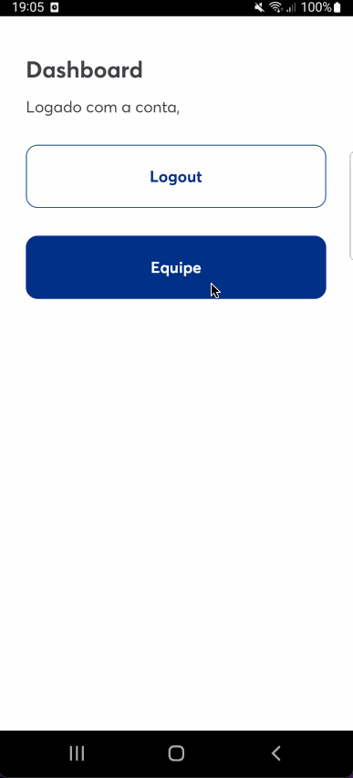
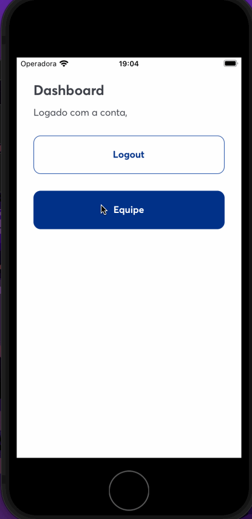
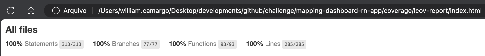

# mapping-dashboard-rn-app

O `mapping-dashboard-rn-app` é o repositório responsável por features de dashboard e fluxos do organograma do MappingApp. É instalado como dependência submódulo do repositório central mapping-core-rn.

## Aplicação em tempo real

### Android

### iOS

## Cobertura do código

